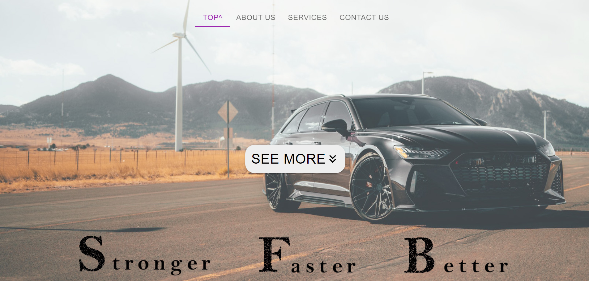
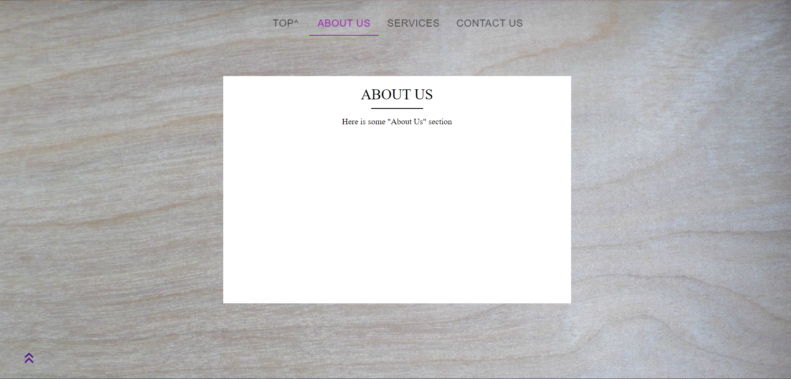
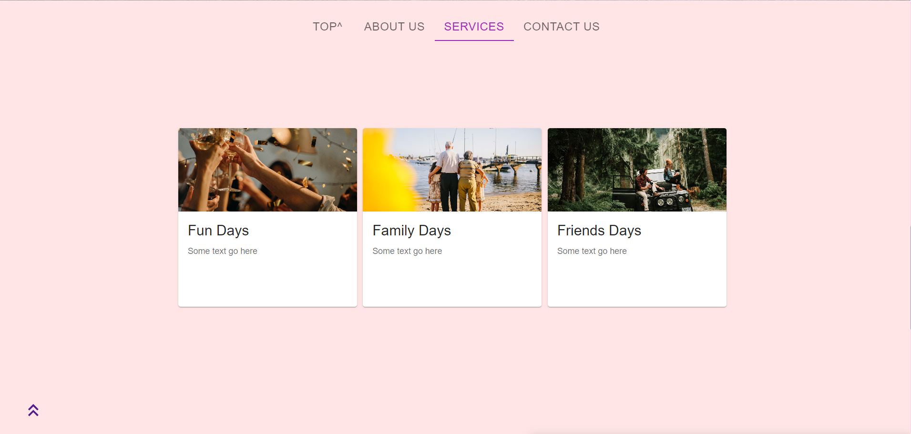
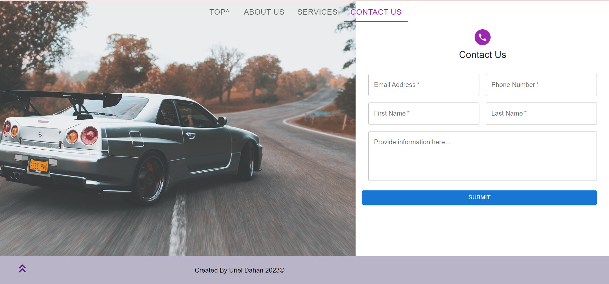

<h1 align="center"> 
     Sample Landing Page Using React.js
</h1>
<h6 align="center"> ©Uriel Dahan- 2024</h6>

## Access to Page

[site-link](https://curious-alpaca-414f68.netlify.app/)

# Sample photos:

   <h4>HomePage</h4>
      

   <h4>A part from the HomePage</h4>
     

   <h4>Contact Us page</h4>
     

   <h4>Cart page</h4>
     
